<p align="center">
  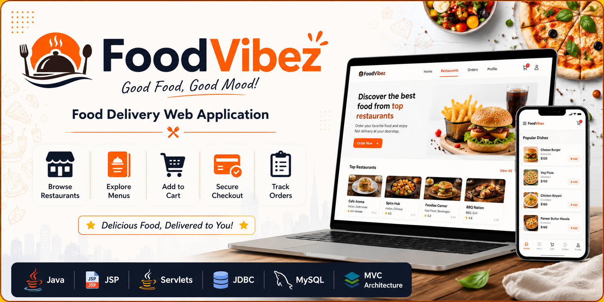
</p>

<h1 align="center">🍽️ FoodVibez - Food Delivery Web Application</h1>

<p align="center">
A dynamic food ordering web application built using <strong>Java, JSP, Servlets, JDBC, and MySQL</strong> following the MVC Architecture.
</p>

<p align="center">
  
  
  
  
  
  
  
</p>

---

# 📖 About the Project

**FoodVibez** is a Java-based Food Delivery Web Application developed using **Java, JSP, Servlets, JDBC, and MySQL**.

The application enables users to browse restaurants, explore menus, manage their shopping cart, place food orders, and view their order history through a clean and user-friendly interface.

The project follows the **MVC (Model-View-Controller)** architecture, ensuring a clear separation between the presentation layer, business logic, and data access layer. It also implements **BCrypt password encryption** for secure user authentication.

---

# ✨ Features

### 👤 User Module
- User Registration
- Secure Login
- Logout
- View & Edit Profile

### 🍽️ Restaurant Module
- Browse Restaurants
- View Restaurant Details
- Explore Restaurant Menus

### 🍕 Menu Module
- Display Food Items
- Dynamic Menu Loading

### 🛒 Cart Module
- Add Items to Cart
- Update Item Quantity
- Remove Items
- View Cart Summary

### 💳 Checkout Module
- Place Orders
- Order Confirmation
- Order Success Page

### 📜 Order Module
- View Order History
- Track Previous Orders

---

# 🏗️ Project Architecture

```
                 User
                   │
                   ▼
            JSP Pages (View)
                   │
                   ▼
        Java Servlets (Controller)
                   │
                   ▼
              DAO Layer
                   │
                   ▼
             MySQL Database
```

---

# 🛠️ Technologies Used

### Frontend
- HTML5
- CSS3
- JavaScript
- JSP

### Backend
- Java
- Jakarta Servlets
- JDBC

### Database
- MySQL

### Build Tool
- Maven

### Server
- Apache Tomcat 10+

### Security
- BCrypt Password Encryption

---

# 📂 Project Structure

```
FoodVibez
│
├── src
│   └── main
│       ├── java
│       │
│       ├── com.tap.Controller
│       │   ├── CartServlet.java
│       │   ├── CheckoutServlet.java
│       │   ├── LoginServlet.java
│       │   ├── LogoutServlet.java
│       │   ├── MenuServlet.java
│       │   ├── OrderHistoryServlet.java
│       │   ├── ProfileServlet.java
│       │   ├── RegisterServlet.java
│       │   ├── RestaurantServlet.java
│       │   └── UpdateProfileServlet.java
│       │
│       ├── com.tap.DAOImpl
│       │   ├── MenuDAOImpl.java
│       │   ├── OrderDAOImpl.java
│       │   ├── OrderItemDAOImpl.java
│       │   ├── RestaurantDAOImpl.java
│       │   └── UserDAOImpl.java
│       │
│       ├── com.tap.DAOInterface
│       │   ├── MenuDAO.java
│       │   ├── OrderDAO.java
│       │   ├── OrderItemDAO.java
│       │   ├── RestaurantDAO.java
│       │   └── UserDAO.java
│       │
│       ├── com.tap.model
│       │   ├── Cart.java
│       │   ├── CartItem.java
│       │   ├── Menu.java
│       │   ├── Order.java
│       │   ├── OrderItem.java
│       │   ├── Restaurant.java
│       │   └── User.java
│       │
│       └── com.tap.utility
│           └── DBConnection.java
│
├── src/main/webapp
│   ├── images
│   ├── WEB-INF
│   │   └── web.xml
│   ├── Cart.jsp
│   ├── Checkout.jsp
│   ├── Login.jsp
│   ├── Menu.jsp
│   ├── OrderHistory.jsp
│   ├── OrderSuccess.jsp
│   ├── Profile.jsp
│   ├── Register.jsp
│   └── restaurant.jsp
│
├── screenshots
├── pom.xml
└── README.md
```

---

# 💾 Database

The application uses **MySQL**.

### Main Tables
- Users
- Restaurants
- Menu
- Orders
- OrderItems

---

# 🔐 Authentication & Security

- BCrypt Password Encryption
- Session Management
- Secure Login Authentication
- Password Hashing before Database Storage

---

# 🚀 Getting Started

## 1️⃣ Clone the Repository

```bash
git clone https://github.com/Kavyahrr/FoodVibez-Food-Delivery-WebApp.git
```

## 2️⃣ Import the Project

Import the project into **Eclipse IDE** as an **Existing Maven Project**.

## 3️⃣ Configure MySQL

Create a MySQL database and update the database connection details in:

```
src/main/java/com/tap/utility/DBConnection.java
```

Example:

```java
private static final String URL = "jdbc:mysql://localhost:3306/foodvibez";
private static final String USERNAME = "root";
private static final String PASSWORD = "your_password";
```

Create the required database tables based on the project's model classes before running the application.

## 4️⃣ Configure Apache Tomcat

- Apache Tomcat 10+
- Java 17 or Java 21

## 5️⃣ Run the Application

```
http://localhost:8080/FoodVibez/
```

---

# 📸 Application Screens

## Authentication

| Login | Register |
|--------|----------|
| 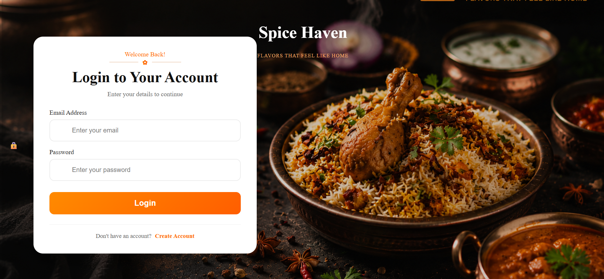 | 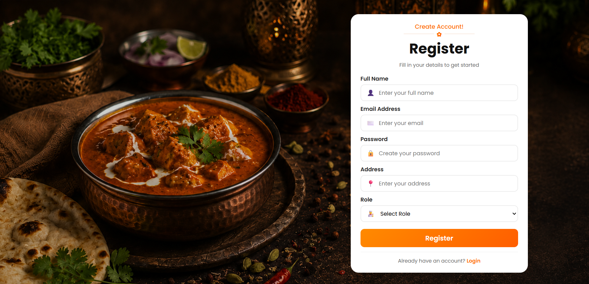 |

---

## Restaurants

| Restaurant Listing | Restaurant Details |
|--------------------|--------------------|
| 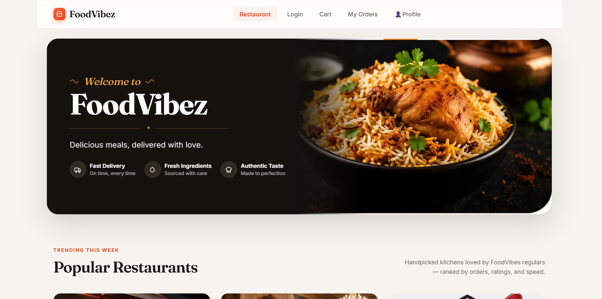 | 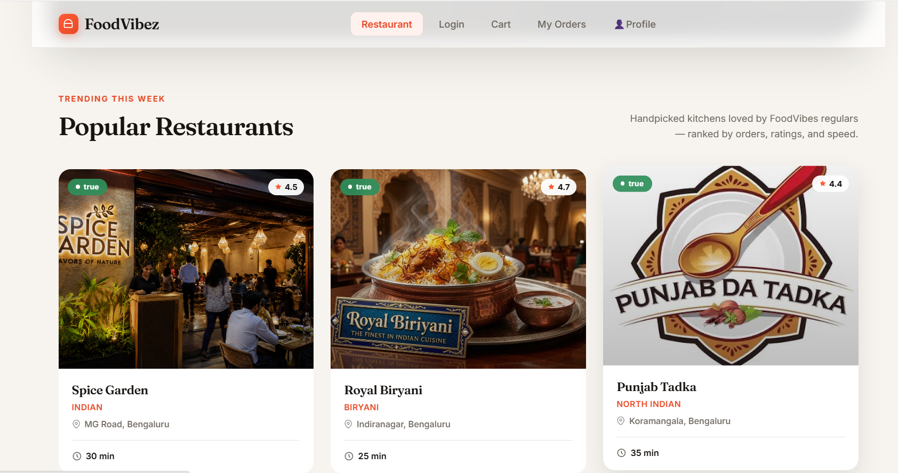 |

---

## Food Ordering

| Menu | Cart |
|------|------|
| 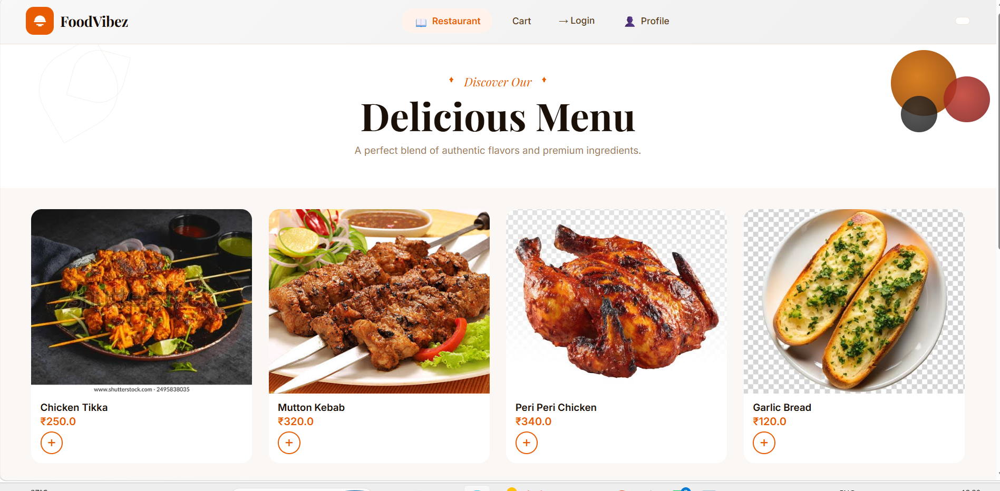 | 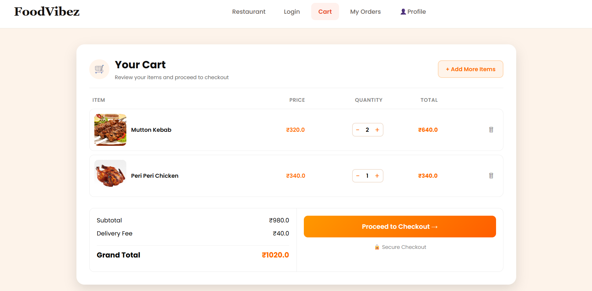 |

| Checkout | Order Success |
|----------|---------------|
| 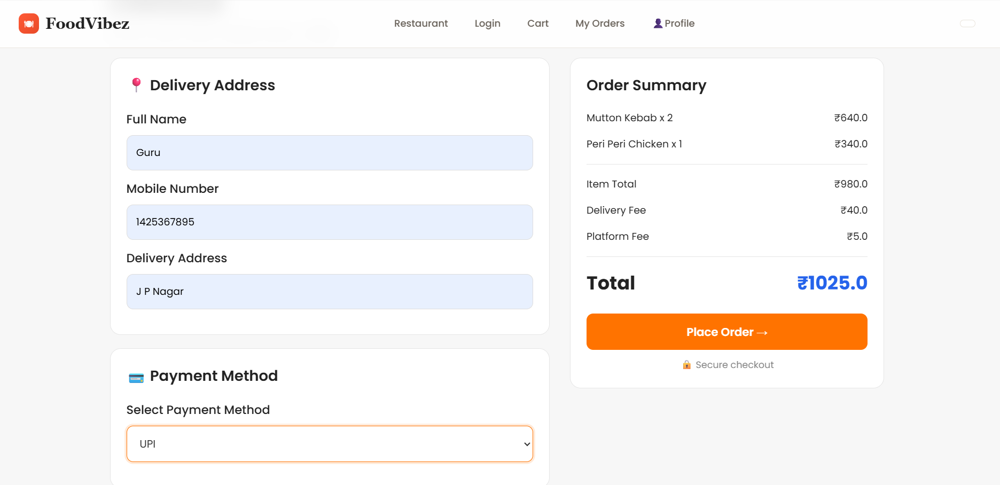 | 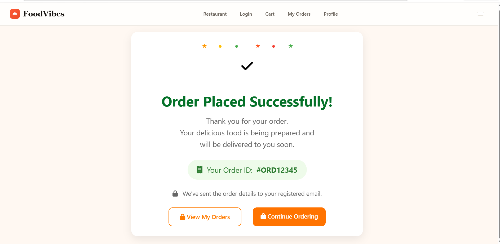 |

---

## User Dashboard

| Order History | Profile |
|--------------|---------|
| 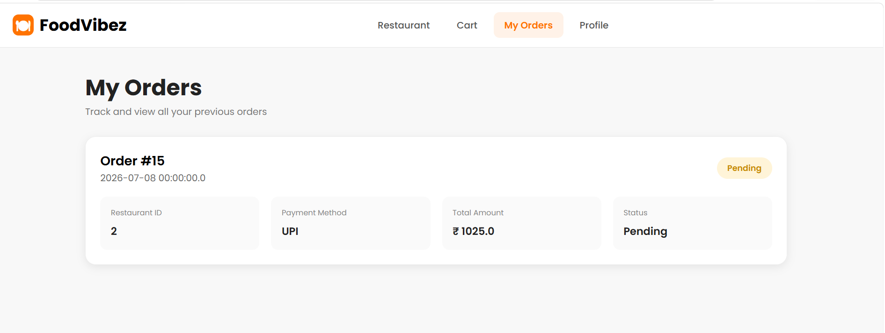 | 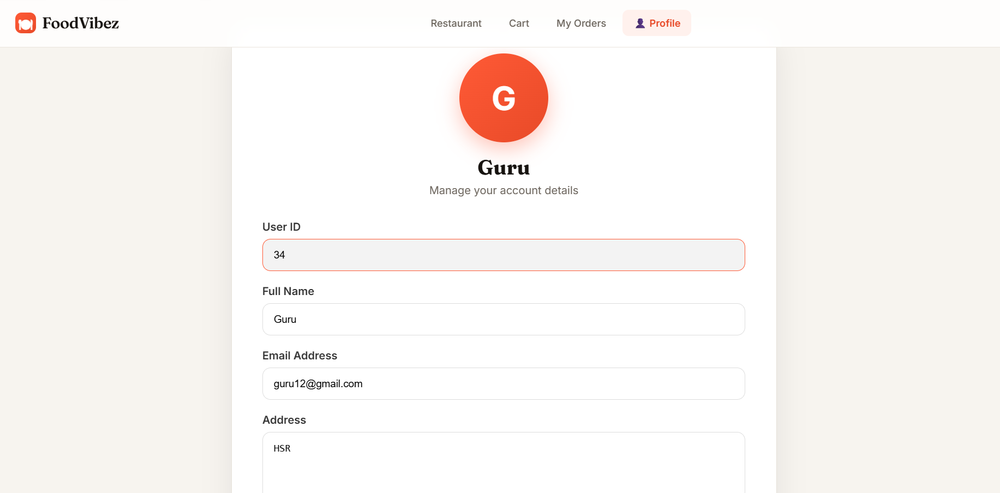 |

### Edit Profile

<p align="center">
  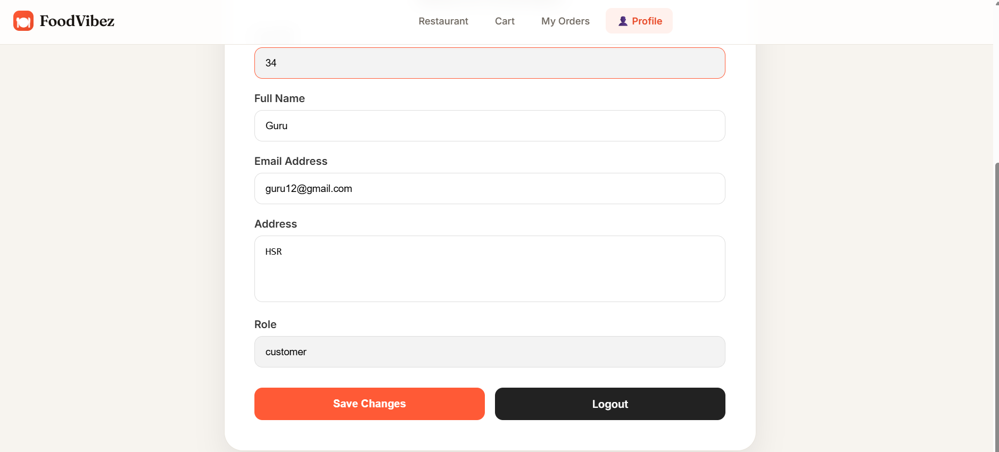
</p>

---

# 📚 Learning Outcomes

This project helped me gain practical experience in:

- Java Web Development
- MVC Architecture
- JSP & Servlets
- JDBC Connectivity
- DAO Design Pattern
- CRUD Operations
- Session Management
- User Authentication
- BCrypt Password Encryption
- MySQL Integration
- Shopping Cart Functionality
- Order Processing Workflow

---

# 🚀 Future Enhancements

- Online Payment Gateway
- Admin Dashboard
- Restaurant Owner Dashboard
- Live Order Tracking
- Food Ratings & Reviews
- Search & Filter Restaurants
- Wishlist Feature
- Email Notifications
- OTP Verification
- Fully Responsive Mobile Design

---

# 👩‍💻 Developer

**Kavya D**

🎓 B.E. Computer Science and Engineering  
University BDT College of Engineering, Davangere

💼 Software Development Intern

🌱 Aspiring Java Full Stack Developer

I enjoy building Java-based web applications and continuously improving my skills in backend development, database management, and full-stack technologies through hands-on projects.

---

# 📬 Connect With Me

<p align="left">
<a href="https://github.com/Kavyahrr">

</a>

<a href="https://www.linkedin.com/in/kavyad24">

</a>
</p>

# ⭐ Show Your Support

If you found this project useful, consider giving it a ⭐ on GitHub.

Your support motivates me to continue learning and building more Java projects.
